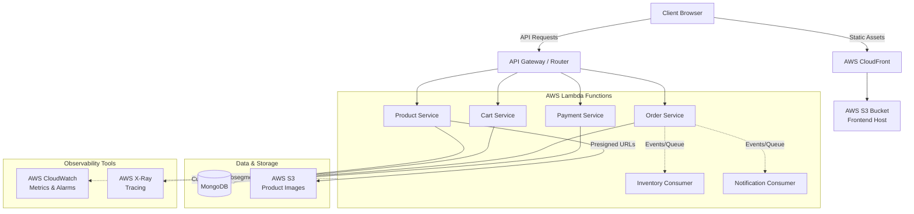

# LUMINA Architecture

Welcome to the E-Commerce Platform! This README provides a comprehensive overview of the architecture, key functionalities, deployment strategies, and observability tools employed in this project.

##  Architecture Diagram

### Architecture Overview
The application is built using a modern serverless microservices architecture:
- **Frontend**: A React application hosted on an AWS S3 bucket and distributed globally via AWS CloudFront for low-latency access.
- **Backend**: Divided into several focused microservices (Product, Cart, Order, Payment, Inventory, and Notification). These run completely serverless as AWS Lambda functions.
- **Database**: MongoDB serves as the primary data store across the microservices.
- **Storage**: AWS S3 is used for securely storing and serving product images via dynamically generated pre-signed URLs.

---

##  Additional Functionalities

Beyond standard CRUD operations, this project employs several advanced features to enhance performance and user experience:

- **Pagination**: Implemented at the database level (e.g., in the `ProductService`). It accepts `page` and `limit` query parameters, utilizing MongoDB's `.skip()` and `.limit()` methods. This ensures the frontend only loads data in manageable chunks, vastly improving load times for large catalogs.
- **Search & Sorting**: The backend supports dynamic filtering (e.g., by name or category regex) and various sorting options (price, alphabetical, newest) directly in the database queries.
- **Secure Direct-to-S3 Uploads**: Instead of routing heavy image uploads through the Lambda functions, the Product Service generates short-lived AWS S3 Pre-signed URLs. The client uses these URLs to upload files directly to the S3 bucket, reducing server load and bandwidth costs.

---

##  CI/CD Pipeline

The project utilizes GitHub Actions (`.github/workflows/ci_cd.yml`) for robust Continuous Integration and Continuous Deployment. 

### Pipeline Stages:
1. **Change Detection**: Analyzes Git diffs to identify exactly which microservices or frontend files were modified, ensuring we only build and deploy what has changed.
2. **Build & Unit Testing**: Installs Node.js dependencies and runs coverage-enabled unit tests (`node --experimental-test-coverage --test`) for the affected services.
3. **Security Scanning (SAST & SCA)**: Integrates with **Snyk** to run Static Application Security Testing (SAST) on the codebase and Software Composition Analysis (SCA) on the dependencies, catching vulnerabilities before they reach production.
4. **Deploy Backend**: Zips the updated microservices and deploys them directly to AWS Lambda via the AWS CLI (`aws lambda update-function-code`).
5. **Deploy Frontend**: Builds the React application, syncs the static files to the S3 bucket, and triggers an AWS CloudFront invalidation to instantly serve the latest version to users.

---

##  Observability: AWS X-Ray Tracing & CloudWatch

In this architecture, AWS X-Ray is instrumented directly within the application code rather than relying solely on the active tracing toggle in the AWS Lambda configuration. 

**Why did we do this?**
Simply enabling manual X-Ray tracing on a Lambda function only tracks the invocation up to the Lambda handler itself. It treats the function execution as a "black box". 
By importing the `aws-xray-sdk` and instrumenting the Express.js app inside the Lambda (e.g., `AWSXRay.express.openSegment` and capturing the global `http`/`https` agents), we gain **granular, subsegment-level visibility**. This allows us to precisely measure the time spent in:
- Specific Express route executions.
- Database queries.
- Downstream HTTP calls to other services or 3rd-party APIs.
This deeper insight is invaluable for profiling bottlenecks and debugging complex distributed requests.

### CloudWatch Alarms
To proactively monitor the health and performance of the platform, we have configured specific AWS CloudWatch Alarms. *(Note: The thresholds below are deliberately lowered for testing and showcasing purposes.)*
- **API Gateway Latency**: Triggers if latency `> 2000ms` within a 1-minute period.
- **API Gateway 5xx Errors**: Triggers if there are `> 2` errors within a 1-minute period.
- **Revenue KPI**: Triggers if revenue is `< $500` within a 1-minute period.
- **Cart Abandonment Rate**: Triggers if the rate is `> 40%` within a 1-minute period.
- **Checkout Success Rate**: Triggers if the rate is `< 80%` within a 1-minute period.
- **Order Lambda Errors (4xx & 5xx)**: Triggers if there is `> 1` error within a 1-minute period.

### Structured Logging
When critical actions fail (e.g., a checkout attempt in the `OrderService`), the system generates rich **structured logs**. Instead of just logging a generic error message, the Lambda outputs a comprehensive JSON log that includes:
- `user_id`: To identify who experienced the issue.
- `trace_id`: To seamlessly jump from the log to the exact AWS X-Ray trace.
- `cart_value` & `payment_method`: For business context on the failed transaction.
- `duration_ms`: To see if the failure was a timeout or a fast failure.
- `status` and `error`: The explicit failure reason.

These structured logs can later be easily parsed, queried, and visualized using tools like CloudWatch Logs Insights.

---

##  Business Metrics

Data-driven decisions are powered by tracking custom business metrics, prominently **Checkout Success Rate** and **Cart Abandonment Rate**.

- **How it is tracked and fetched**: 
  When specific events occur (like an order creation attempt), the microservices publish custom metrics to AWS CloudWatch under the namespace `Lumina/BusinessMetrics`. 
  To visualize this data, the `OrderService` provides an `/analytics` endpoint. When called, it uses the AWS SDK (`GetMetricStatisticsCommand`) to fetch the daily average data points for these metrics over the past 7 days directly from CloudWatch.
- **Polling Interval**:
  The Admin Dashboard on the frontend utilizes a React `useEffect` hook to fetch these analytics on load, and subsequently sets up a `setInterval` to re-fetch the data every **6 hours**. This ensures administrators always have access to relatively fresh data without overwhelming the backend or CloudWatch APIs with excessive requests.
